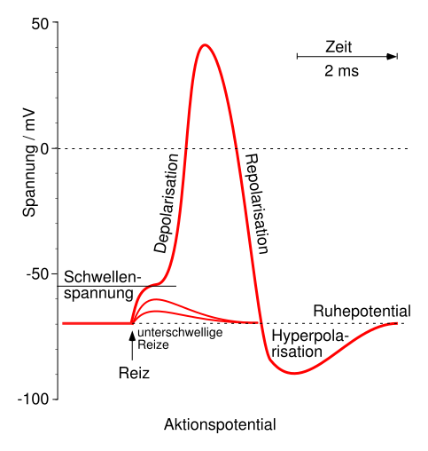
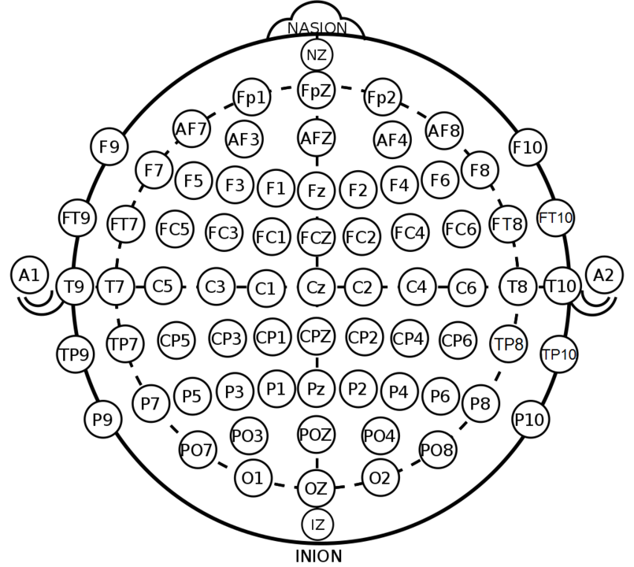
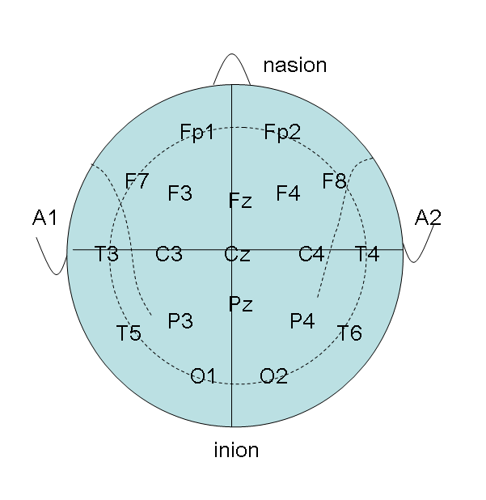
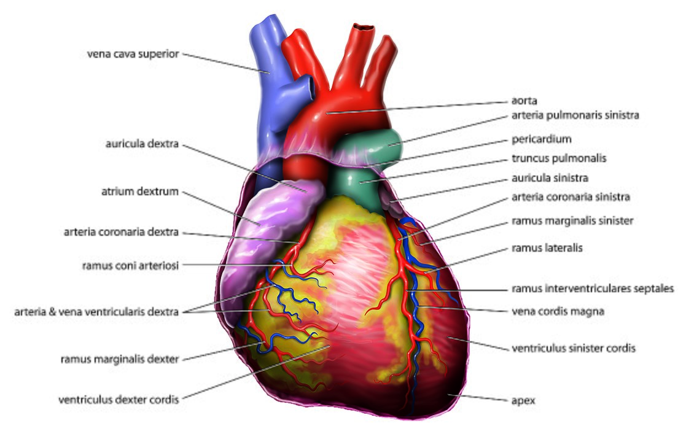
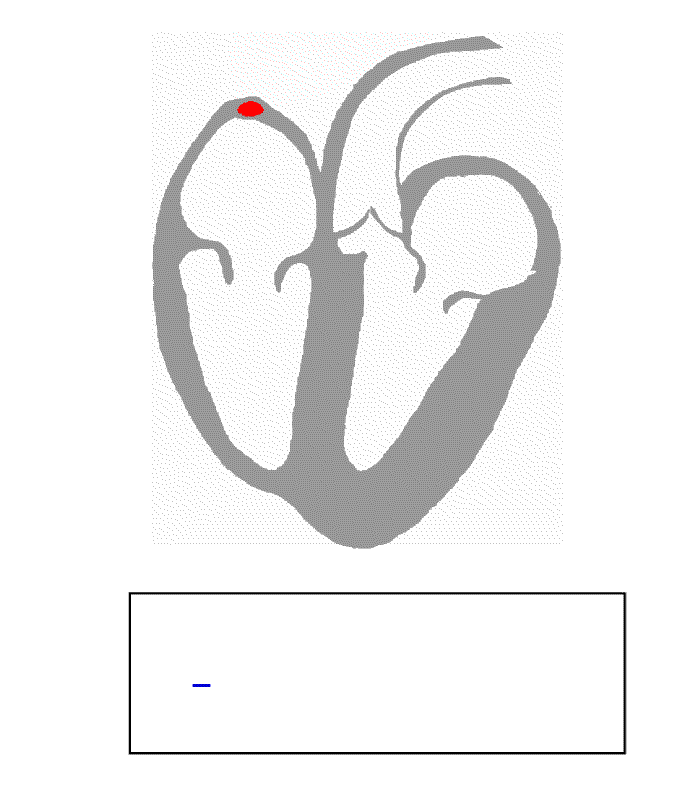
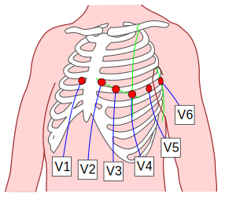
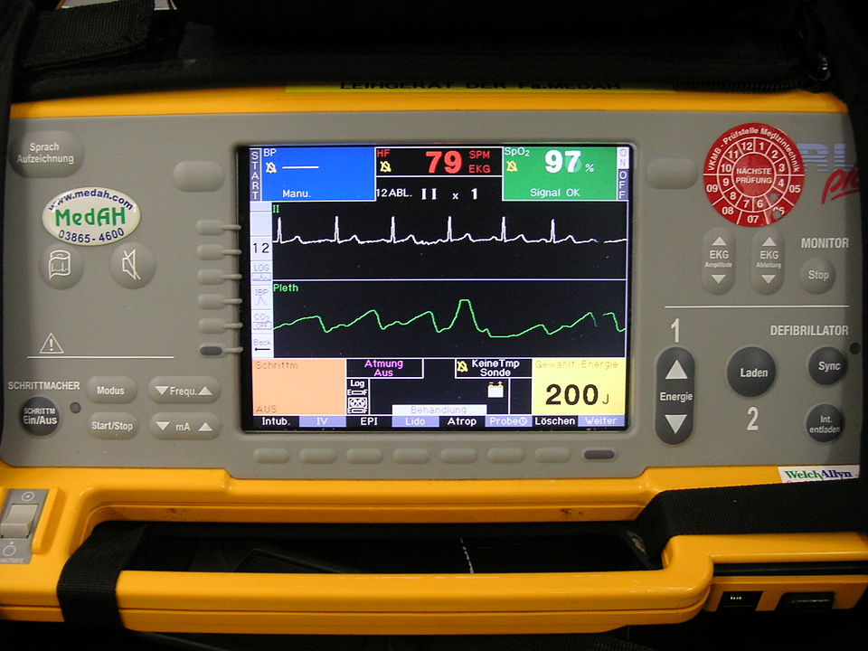

# Einleitung
>"Medizinische Informatik ist die Wissenschaft von Informationsverarbeitung und der Gestaltung informationsverarbeitender Systeme in der Medizin."

Detaillierter:
>"Die Medizinische Informatik ist die Wissenschaft der systematischen Erschließung, Verwaltung, Aufbewahrung, Verarbeitung und Bereitstellung von Daten, Informationen und Wissen in der Medizin und im Gesundheitswesen. Sie ist von dem Streben geleitet, damit zur Gestaltung der bestmöglichen Gesundheitsversorgung beizutragen." (GMDS = Deutsche Gesellschaft für Medizinische Informatik, Biometrie und Epidemiologie)

Damit die nötigen Daten und Informationen und das benötigte Wissen fachgerecht erfasst, aufbewahrt, abgerufen, verarbeitet und verteilt werden können, entwickeln, betreiben und evaluieren Medizinische Informatiker/innen Infrastrukturen, Informations-und Kommunikationssysteme einschließlich solcher für Medizintechnische Geräte.

## Die Einsatzfelder medizinischer Informatik nach dem Prozess der Entscheidungsfindung in der Medizin:
- **Physiologische oder phatologische Zustände** => Messen 
  - Biosignalerfassung
    - Bioelektrische und nicht elektrische Signale
    - Physiologische Ursache dieser Signale
    - Messverfahren, Ableitungen
    - Anforderungen an Hard- und Software
  - Bildgebung
    - Bildgebenden Verfahren (Modalitäten)
    - Indikationen zur Anwendung (Was kann womit gut erkannt werden?)
- **Signal/Bild** => Analyse 
  - Biosignalverarbeitung und Bildverarbeitung
    - Vorverarbeitung, Signalkonditionierung
    - Ereignisdetektion, Merkmalserkennung
    - Klassifikation, Segmentierung
    - Parameterextraktion, Kopplungsanalyse
- **Merkmale** => Entscheidung 
  - Expertendatenbanken
  - Therapieplanung und Therapieüberwachung
    - Bestrahlungsplanung
    - Medikamentendosierung
    - Leitlinien
- **Diagnose/Therapie** => Dokumentation
  - Datenübertragung, Datenspeicherung, Dokumentation
    - Übertragung von Aufträgen (HL7)
    - Übertragung von Bildinformationen (DICOM)
  - Datenmanagement im Gesundheitswesen
    - Elektronische Patientenakte
    - Elektronische Gesundheitskarte
  - Krankenhausinformationssysteme
    - OP-Planungssystem
    - Laborinformationssystem
    - Radiologie-Inf.-syst. (RIS)
    - Patientenverwaltung
    - Bettenplanung
    - Personalverwaltung
  - Telemedizin
    - Home-Monitoring
    - Tele-Chirugie
  - Biostatistik
- **Kommunikation, Archivierung**

## Motivation

	- 50% Arbeitszeit von Mediziner: Suche, Erfassung und Wiedergabe von Informationen
	- 39% der Gesamtaufwendungen eines Krankenhauses für Informationsverarbeitung
	- 20% der Arbeitszeit: für Suche nach früheren Informationen
	- 10% der Laborergebnisse erreichen nie den Stationsarzt
	- 80% der Patienten bei Übergabe (Einweisung, Überweisung) mit unvollständigen wichtigen Informationen
	- Noch nicht ausgeschöpftes Potenzial: bis zu 20% Kostenreduktion, bis 300% Erhöhung des Patientendurchsatzes

# (Entstehung und) Erfassung bioelektrischer Signale

| Bioelektrische Signale | Nichtelektrische Signale |
|:--:|:--:|
| EGK | Blutdruck |
| EEG | Herminutenvolumen |
| EMG | Temparatur |
| ERG, EOG, VEP, ... | Augeninnendruck, ... |

Merkmale bioelektrischer Signale:
- Unmittelbare Information über Vorgänge an Nerven und Muskeln
- Repräsentation physiologischer und pathologischer Veränderungen => Globale und detaillierte Beurteilung der Organfunktion
- Zumeist nichtinvasiv (Signalableitung an der Körperoberfläche) => Geringe Belastung für den Patienten
- Kostengünstig

Quellen/Ursprung bioelektrischer Signale: Nerven und Muskeln
|  | | 
| -- | -- |

Beide Gewebearten haben spezielle Eigenschaften:
- Erregbarkeit
  - elektrisch
  - mechanisch
  - chemisch
- Erregungsfortleitung:
  - innerhalb der Zelle vom erregten Abschnitt zum benachbarten Abschnitt
  - von Zelle zu Zelle

Aktionspotential
- Ursachen:
  - Ionenpumpen (insbes. Kalium-Natrium-Pumpe)
  - Selektive Permeabilität von Ionenkanälen
  - Chemische und elektrische Gradienten (Potentiale)
  - Messung des Zellinneren gegen das Zelläußere!
- Ruhepotential 
  - ist das elektrische Potential (Potentialdifferenz) an einer Membran nach Einstellung des elektrochemischen Gleichgewichts (Betrag des elektrischen Potentials = Betrag des chemischen Potentials).
  - Ursache (I): 
    - Kalium-Natrium-Pumpe(pro ATP: 3 Na+-Ionen nach außen und nur 2 K+-Ionen nach innen)
  - Ursache (II):
    -Natriumkanäle geschlossen => keine (nur sehr geringe) Diffusion von Na+ nach innen
    -Kaliumkanäle offen =>  Diffusion von K+-Ionen nach außen entlang des chemischen Gradienten und entgegen des elektrischen Gradienten => Einstellung des elektrochemischen Gleichgewichts
- Depolarisation wenn Störung des Ruhepotentials (z.B. durch elektrische Erregung) über das Schwellwertpotential (-55 mV) hinaus, dann
    - => Öffnung der spannungsabhängigen Natriumkanäle
    - => Einschießen von Na+ ins Zellinnere (schneller Prozess)
    - => Umpolarisieren des Membranpotentials bis zur Einstellung des Natrium-Gleichgewichtspotentials
- Repolarisation:
  - Schließen der Natriumkanäle
  - Öffnen der Kaliumkanäle
  - => Austrittvon K+ aus dem Zellinneren (langsamer Prozess)
- Plateau (Herzmuskelzelle)
  - zusätzliches Einströmen von $Ca^{2+}$-Ionen ins Zellinnere (langsamer Prozess)
  - Verzögerung der Repolarisation
  - Ausbildung eines Plateaus (Refraktärzeit der Herzmuskelzelle)

### Elektrophysiologische Untersuchung
Elektrophysiologische Untersuchungen werden in drei Teilgebiete unterteilt:
- **Zentralnervensystem** => Elektroenzephalographie (EEG)
- **Herz** => Elektrokardiographie (EKG)
- **Muskulatur** => Elektromyographie (EMG)

weitere Biosignale:
- Retinale Potentiale: Ableitung elektrischer Potentiale am Auge
  - **Elektrookulogramm(EOG)**: Erfassung von Augenbewegungen, Ableitung an den Lidwinkeln
  - **Elektroretinogramm(ERG)**: retinaleelektrische Antwort auf Lichtreizung, Ableitung: Cornea => Schläfe
- Evozierte Potentiale: Prüfung einzelner Sinnesfunktionen bzw. deren zentralnervöse Strukturen durch gezielte Stimulation
  - somatosensorisch evozierte Potentiale (SEP)
  - akustisch evozierte Potentiale (AEP)
  - visuell evozierte Potentiale (VEP)
  - => Gesichtsfelduntersuchung (Perimetrie)

## Elektroenzephalogramm (EEG)
Elektroenzephalogramm (EEG) ist die Ableitung der elektrischen Aktivität (Potentialschwankungen) des Gehirns an der Kopfoberfläche.\
Elektrokortikogramm (ECoG) ist die Ableitung der elektrischen Aktivität direkt am Kortex(z.B. bei operativen Eingriffen)

### Signalkomponenten
Die verschiedenen Ryhtmen (Frequenzbänder) können beim EEG immer bestimmten Zuständen zugeordnet werden:
| Bezeichnung | Frequenz | Zustand | Spannung | betreffend |
|:--:|:--:|:--:|:--:|:--:|
| Delta | 1-4Hz | Tiefschlaf | <200 müV | ganzer Cortex |
| Theta | 4-8 Hz | Schläfrigkeit, psychische Störung | <100 müV | parietal |
| Alpha | 8-13 Hz | Ruhe und Entspannung | <50 müV | okzipital |
| Beta | 13-35 Hz | Aktivität, Denken | <50 müV | frontal, parietal |
| Gamma | 35-100 Hz | starke Konzentration, Lernprozess | | |

### Positionen zur EEG Ableitung
|  |  |
| :--: | :--: |
|  | |

### Diagnostischer Informationsgehalt
Anwendungsgebiete in Diagnostik und Therapie: Epilepsie, Objektive Perimetrie (objektive Vermessung des Gesichtsfeldes), Neurofeedback, Narkosetiefe, Schlafmedizin (Polysomnographie), Kognitionsforschung (Gedächtnisprozesse), Hirntodbestimmung, Schlaganfall, Tumore, Hirnreifung, Psychiatrische Erkrankungen

## Elektrokardiogramm (EKG)
Elektrokardiogramm ist der zeitliche Verlauf der an der Körperoberfläche abgeleiteten Potentialschwankungen des Herzens
- nichtinvasive Ableitung
- relativ geringer zeitlicher und personeller Aufwand
- am häufigsten abgeleitetes Biosignal
- außerdem:
  - Ösophagus-EKG => EKG-Ableitung in der Speiseröhre
  - Intrakardiales EKG => EKG-Ableitung am offenen Herzen

| |  |
| -- | -- |
| Anatomie des Herzens | EKG-Komponenten einer Herzperiode |

### Physiologie/Signalkomponenten einer Herzperiode
| EKG Komponente | Physiologie | charakterist. Merkmale |
| -- | -- | -- |
| P-Welle | Erregung der Vorhöfe | kleine positive Welle |
| PQ-Strecke | Zeit vom Beginn der Vorhoferregung bis zum Beginn der Kammererregung, sog. Erregungsüberleitungszeit| verläuft auf der isoelektrischen Linie; PQ-Dauer ist abhängig von der Herzfrequenz |
| QRS-Komplex | Kammererregung, besteht aus Q-Zacke, R-Zacke und S-Zacke | Form des QRS-Kompl. ist bei den Extremitätenableitungen abhängig von der Herzachse |
| ST-Welle | Zeit, in der die gesamte Kammermuskulatur erregt ist | verläuft normalerweise auf der isoelektrischen Linie |
| T-Welle | Rückbildung der Kammererregung | breiter und flacher als der QRSKomplex, da die Rückbildung nicht über feste Bahnen verläuft |
| U-Welle | Nachschwankung der Kammererregungsrückbildung | sehr klein und nicht immer registrierbar |

### Widerspieglung des Errregungsablaufs (Herzzyklus) im EKG
- Elementarvektor = Vektor, der die Erregung einer einzigen Muskelfaser widerspiegelt
- Summationsvektor = Resultat mehrerer Vektoren nach dem Kräfteparallelogramm
- elektrische Herzachse = Gesamtsummationsvektor bei Erregung der Herzkammern
- Modellierung als Dipol = Summe elementarer Dipole einzelner Herzmuskelzellen extrazellulär, d.h.  + =: unerregt; - =: erregt

### EKG Ableitungen
#### Extremitätenableitung nach Einthoven
- bipolare Ableitung
- Ableitungsbezeichnungen: I, II und III
- Ableitorte: rechter Arm (rot), linker Arm (gelb), linker Fuß (grün)

#### Extremitätenableitung nach Goldberger
- unipolare Ableitung
- Ableitungsbezeichnungen: aVR, aVL, aVF
- Projektion der Frontalebene (um 30 Grad gegenüber Einthoven-Ableitung gedreht)

#### Thorax-Ableitung nach Wilson
- unipolare Ableitung
- Ableitungen: V1 ... V6 (Standard)
- Projektion der Horizontalebene
- Referenzelektrode: Herzmitte => hochohmige Zusammenschaltung der Extremitätenableitung

nach Wilson: 

#### Altersabhängigkeit der Herzachse
- elektrische Herzachse = Gesamtsummationsvektor bei Erregung der Herzkammern
- Rechtstyp (RT): Säuglings- und Kindesalter
- Steiltyp (ST):  jugendliches Alter
- Mitteltyp (IT): jüngeres Erwachsenenalter
- Linkstyp (LT): Erwachsenenalter und ältere Menschen
- Überdrehte Rechts- u. Linkstypen (ÜRT, ÜLT) sind pathologisch

### Diagnostischer Informationsgehalt
Morphologische Untersuchung und Herzfrequenz Analyse
- Herzinfarkt
  - Verengung oder Verschluß eines koronaren Herzkranzgefäßes
  - deutliche Hebung der ST-Strecke
  - Verschmelzung mit folgender T-Welle ("monophasische Deformierung")
- Extra-Systolen
  - frühzeitig auftretender Extraschlag aus dem Kammerbereich
  - Einsetzen eines verbreiterten und deformierten QRS-Komplexes
  - kompensatorische Pause, weil Sinusrhythmus in Takt ist
- AV-Block
  - Störung der Erregungsleitung zwischen Vorhof und Kammer
  - Grad 1: PQ-Verlängerung
  - Grad 2: gelegentlicher (Typ Wenkebach) oder regelmäßiger (Typ Mobitz) Ausfall eines Kammerschlages
  - Grad 3: Keine Kopplung zw. Vorhof- u. Kammererregung => Schrittmacher

### Digitale EKG Signalanalyse
EKG-Signaleigenschaften
- R-Zacke = zentraler Punkt im QRS-Komplex
  - hat in der Regel die größte Amplitude und den größten Anstieg bzw. Abfall 
  - -> hebt sich somit meist als Peak hervor (Polarität kann verschieden sein)
- Amplitudenbereich : 0,5 - 4 mV (ortsabhängig)
- Frequenzbereich EKG : 0,2 - 150 Hz
- Frequenzbereich QRS-Komplex : 5 - 30 Hz
- Dauer eines QRS-Komplexes : 60 - 100 ms
- zu wählende Abtastfrequenz ist abhängig vom Zweck der Untersuchung 
  - z.B. Spektralanalyse des QRS-Komplexes zur Analyse von Spätpotentialen -> hochauflösendes EKG : 1 - 2 kHz
  - zur Herzrhythmusanalyse : 200 - 500 Hz ausreichend

Grundprinzip QRS-Detektion: Roh-EKG -> Vorverarbeitung -> QRS-Detektion (inkl Signal Transformation)

- maximaler, mittlerer und minimaler RR-Abstand: $RR_{min}, RR_{max}, \overline{RR}$
- Standardabweichung der RR-Abstände: $S_{RR}= \sqrt{\frac{1}{n-1} * \sum_{i=1^n}(RR_i - \overline{RR}^2)}$
- Variationskoeffizient: Quotient aus Standardabweichung und mittlerem RR-Abstand $VK=\frac{S_{RR}}{\overline{RR}}$
- RMSSD (root mean squared successive difference) = Kenngröße zur Quantifizierung der Variationen aufeinanderfolgender RR-Abstände $RMSSD = \sqrt{\frac{\sum_{i=1}^{n-1} (RR_{i+1}-RR_i)^2}{n}}$
- BB50 (pNN50): relativer Anteil [%] von aufeinanderfolgenden RR-Abständen, mit Differenz größer als 50 ms
- MCR: Betrag des mittleren Summenvektors aller event-Vektoren auf dem Atemperioden-Einheitskreis
- E/I-Quotient: mittlerer Quotient aus längstem RR-Abstand während forcierter Expiration und kürzestem RR-Abstand während forcierter Inspiration; spez. Kenngröße der Respirationsphase
- 30/15-Quotient: Quotient aus dem längsten RR-Abstand etwa um den 30. Herzschlag und dem kürzesten RR-Abstand etwa um den 15. Herzschlag nach Aufstehen; Kenngröße zur Charakterisierung der Orthostasereaktion
- Herzfrequenvariabilität (HRV)
  - VLF $<= 0.04$ Hz:	Thermoreg. Einflüsse
  - LF $0.04- 0.15$ Hz: Barorezeptorische Einflüsse
  - HF $0.15 - 0.4$ Hz: Resp. Sinusarrhythmie (RSA)
- Intervall-Tachogramm: Problem: keine äquidistante Impulsfolge -> kontinuierliches Herzfrequenzsignal notwendig

## Elektromyogramm (EMG)
elektrische Aktivität hervorgerufen durch Muskelaktivität. Gemessen über Oberfläche oder mit Nadel
### Motorische Einheit
- := einzelnes Motoneuron (Nervenzelle + Nervenfaser) inkl. seiner innervierten Muskelfasern
- Das Feuern eines Motoneurons bewirkt die Kontraktion mehrerer Muskelfasern
- Die Kraft der Muskelkontraktion wird gesteuert durch:
  - die Anzahl der erregten Axone (Rekrutierung)
  - die Frequenz der Aktionspotentiale auf jedem Axon (Frequenzierung)
- MUAP: Aktionspotential motorischer Einheiten

### Grobmotorik vs. Feinmotorik
- **Grob**: Wenige ME mit vielen Muskelfasern pro ME z.B. Oberschenkelmuskel (bis zu 2000 Muskelfasern)
- **Fein**: Viele ME mit wenigen Muskelfasern pro ME z.B. äußere Augenmuskeln (4–40 Muskelfasern)

### Übersicht

- Oberflächen EMG
  - Ableitung des Summenaktionspotentials eines Muskels oder Muskelanteils über Einzelelektronen
- Nadel EMG
  - Fine-Wire-Elektroden:
    - Nadel mit Elektrodenfäden einführen
    - Nadel entfernen, Elektroden verbleiben unter Haut
    - Fäden mit Federn verbinden (bzw elektronischem Schaltkreis)

### Signalanalyse
- Spektralanalyse -> Abfall der mittleren Frequenz als Ermüdungsindex
- Amplitudenzeitverlauf -> gleitende Fensterung

# EKG-Verstärker
Welcher Besonderheiten sind bei der Hardwareentwicklung zu beachten?

Zur Erinnerung:
- Amplitude: 0,5 – 4mV
- Frequenzbereich: 0,2 -150Hz
- Auflösung: 2ksps

Störeinflüsse:
- **Kapazitive Kopplung** Netzinstallation, Leuchtstofflampen
- **Induktive Kopplung** Patientenkabel
- **Galvanische Kopplung** Reeller ohmscher Widerstand (Isolationswiderstand), Masseleitung der Messgeräte (Masseschleife)
- **Elektromagnetische Störungen** Multimediainstallationen (Mobilfunk, Netzwerktechnik,...)

Gegenmaßnahmen:
- Maximal möglicher Abstand
- Maximale Erhöhung der Erdisolation des analogen Front-End
- Software implementierter Notchfilter (50 Hz / 60 Hz) -> besser als Hardware, wegen Übertragungsfkt.
- Primäre Spezifikation ist das Eingangsrauschen (input referred noise: 30mü VRMS bei einer Bandbreite von 150 Hz)
- Schirmung mit Hilfe eines Faraday'schen Käfig
- Anwendung der Guarding-Technologie
- Sternförmiger Massepunkt als Verbindung zwischen analoger und digitaler Masse
- Schirmende Masseflächen zwischen Signalleitungen

## Systemkonzept
Komponenten:\
Medizinisches Messobjekt --> Verstärker --> Filter --> ADC (analog to digital)

Signalpegelanpassung
- Wandler und ADC lassen sich meist nicht direkt verbinden -> Anpassung durch Verstärker
- Anpassung des Ausgangsspannungsbereich von Transducer an Eingangsspannungsbereich ADC
- Oft Veränderung des DC-Levels bis das Signal optimal in den Eingangsspannungsbereich des ADC passt

## Low vs High Resolution
### Low-­Resolution (< 16‑bit) ADCs
- Einsatz rauscharmer Verstärker (mehrstufig) -> erste Stufe bestimmt im Wesentlichen das Rauschen des gesamten Verstärkers
- hohe Signalverstärkung (~500)
- Verstärkerrauschen darf das System nicht dominieren
- Dynamik des Signal muss in Verstärkerkette bereits berücksichtigt werden
- Problematisch: DC-Anteil (oft Filterung, besser ohne)

### High-­Resolution (24‑bit) ADCs
- niedrige Signalverstärkung (~5)
- schwaches Signals wird durch Wandlung mit hochauflösenden ADC kompensiert
- gutes Handling vom DC-Anteil möglich
- weniger Hardwarekomponenten nötig -> Kostenersparnis und 'state of the art'

## Funktionen beim EKG
- Erkennung schlechter Elektrodenkontakt (Lead-off detection )
- Gleichanteil entfernen (DC removal)
- Multi band-pass Filterung
- ECG leads formation
- QRS-Detektion
- Visualisierung des EKGs auf einem Display
- Kommunikationsports: UART, SPI, I2C, External memory interface (EMIF)
- Detektion und Entfernen des Schrittmacherimpuls

## Lead off Detektion
- Überwachung des Elektrodenkontaktes (außer dem 	rechtem Bein - Bezug)
- Die EKG-Elektroden sind an einem hochohmigen Pullupwiderstand (> 10 M) angeschlossen
- Abriss der Verbindung = Anstieg Spannung auf VCC
- Komperator mit Schwellspannung
- Überschreitung = Interrupt am Mikrocontroller

# Pulsoximetrie
- Die Versorgung der Organe mit Sauerstoff ist für den Organismus von entscheidender Bedeutung.
- Medizinisches Interesse besteht an der Überwachung der Oxigenierung des Blutes 
- -> Pulsoximetrie
  - Nicht-invasives Messverfahren
  - Kontinuierliche Erfassung der Sauerstoffversorgung des arteriellen Blutes
  - Prozentuale Angabe des oxygenierten Hämoglobin am Gesamthämoglobin

## Definition Sauerstoffsättigung
- Funktionelle Sauerstoffsättigung $SO_2 = \frac{HbO_2}{Hb + HbO_2}$
  - Verhältnis vom sauerstoffbehaftetem zum gesamten Hämoglobin
  - Beim gesunden Menschen 94-98 %
  - Je nach Sauerstoffsättigung -> Änderung der opt. Eigenschaften
- Fraktionelle Sauerstoffsättigung $SO_2 = \frac{HbO_2}{Hb + HbO_2 + COHb + MetHb}$ (liefert die 'richtigere' Messung da mehr berücksichtigt)

(Hb = Hämoglobin; $O_2$ = Sauerstoff)

## Lambert Beer Gesetz
Lichtquelle (einfallende Lichtintensität $I_0$) Durchstrahlt Medium (Weglänge des Lichts $d$). Photodiode auf anderer Seite des Mediums misst übriges Licht (Lichtintensität $I$). 
- $\epsilon(\lambda)$ Extinktionskoeffizient in L $mmol^{-1}cm^{-1}$;
- $c$ Konzentration in $mmol^{-1}$
- $I = I_0 * e^{-\epsilon(\lambda)cd}$
- in Medium: $I(x)=I_0e^{-\epsilon(\lambda)c(x-a)}$
- Transmission $T= \frac{1}{I_0} = e^{-\epsilon(\lambda)cd}$
- Absorption $A = -ln(T) = \epsilon(\lambda)cd$
- Mehrfachabsorption $A_{tot}=\epsilon_1 (\lambda) c_1 d_1 + \epsilon_2 (\lambda) c_2 d_2 +...+ \epsilon_n (\lambda) c_n d_n$

(Hinweis für die Klausur: Lernt die Funktionsbezeichnenden Bilder!)

## Normierung
Um Rotes und Infrarotlicht zu normieren und vergleichbar zu machen, benötigt man folgende Formel:
$I_n=\frac{1}{I_H}= e^{-[\epsilon_{Hb} (\lambda)c_{Hb} + \epsilon_{HbO_2} (\lambda)c_{HbO_2}] \Delta d}$

## Sensorik
### Lichtquelle & Empfänger
Für nichtinvasive Messung werden Körperstellen gewählt, bei denen arterielle Blutgefäße zugänglich sind, z.B. Finger, Zeh, Ohrläppchen.
- Laser
  - Vorteil: hohe Lichtausbeute und nahezu monochromatisches Licht
  - Nachteil: preisintensiv und schwer zu regeln
  - -> eher ungeeignet
- LED
  - Vorteil: guter Wirkungsgrad, relativ schmales Spektrum, kleine Bauform
  - Nachteil: Temperaturabhängigkeit der mittleren Wellenlänge
  - -> geeignet

#### LED Prinzip
- physikalisch:
  - emittierte Licht entsteht bei der Rekombination von Elektron-Loch-Paaren und ist dabei materialspezifisch
  - größere Wellenlängen besonders wichtig für Medizin -> größere Eindringtiefe in Gewebe (rot, infrarot)
  - Abstrahlcharakteristik: Wiedergabe der Winkelabhängigkeit in normierter Form (bezogen auf die maximale Strahlstärke)
- Temperaturabhängigkeit:
  - Abnahme des Wertes der Energielücke bei zunehmender Temperatur -> Verschiebung des Emissionsmaximums zu höheren
  - Wellenlängen $E=h*f$ und $c=\lambda * f \rightarrow E=h/\lambda$ (h=plansches Wirkungsquantum; )
  - Zunahme der mittleren kinetische Energie der Elektronen bzw. Löcher mit zunehmender Temperatur, d.h. die Elektronen und Löcher halten sich weniger an den	Bandkanten auf

#### Photodiode
- Photodioden sind Halbleiter aus Silizium, welche für Photonen und hoch-energetische Partikel sensitiv sind
- Absorption der Energie unter Umwandlung in elektrische Ladung
- Sensitivitätsbereich: 1pW/cm2 bis 100mW/cm2
- Vielseitiger Einsatz: Spektroskopie, Fotosensoren, optische Positionssensoren, Oberflächencharakterisierung, optische Datenübertragung, Medizinische Bildgebung, Dosimetrie, …
- Unterscheidung der Wellenlängen nur durch Filter möglich! Nicht durch Diode selbst

### Verstärkerschaltung
Ausführungen einer Photosensorschaltung:
- Elementbetrieb (für Pulsoximeter zu langsam)
- Vorgespannter Betrieb (pin-Photodiode, Schottky-Photodiode, Avanlanch-Photodiode)

Photodioden werden meist elektrisch Vorgespannt, indem sie an eine Negative Spannungsversorgung angeschlossen werden.
1. Transimpedanzverstärker
2. Invertierender Spannungsverstärker
Für Hochgeschwindigkeitsanwendungen
- Besonders große Vorspannung -> begrenzt durch Sperrspannungsfestigkeit der Diode
- Großer Lichtstrom benötigt

# Grundlagen der Biosignalverarbeitung
## Analog-Digital-Wandlung
- Abtastung und Quantifizierung
  - Auflösung: N Bit
  - Referenzspannung: $U_{Ref}$
  - Quantisierungsintervall: $q=A_{LSB} = \frac{U_{Ref}}{2^N}$
  - Wertebereich: $0... (2^N -1)*U_{LSB}$
- Komponenten
- Wandlungsprinzipien
  - direktvergleichende ADC
    - Wägeverfahren: Sukzessive Approximationswandler
      - Abtastung durch Sample & Hold-Schaltung
      - Sukzessive Annäherung einer mittels DAC erzeugten Spannung an die zu messende Spannung (von $U_{MSB}\rightarrow U_{LSB}$ )
      - DAC-Eingangswert entspricht Messwert
    - parallele Verfahren: Parallelwandler
      - Komparatoren: $(2^N-1)$
      - Widerstände: $(2^N-2)*R$
      - $R_{Ges}=2^N*R$
      - Komparatoren vor D-Flip-Flops -> "Digitales Abtast-/Halteglied"
  - Zählverfahren
    - u/t-Umsetzer: Dual-Slope-Wandler/ Multi-Slope-Wandler
      - $u_2= -\frac{1}{RC} \int u_1(t) dt$ und $u_x=u_{Ref}*\frac{T_x}{T_{int}}$
    - u/f-Umsetzer: Sigma-Delta-Wandler
      - $U_{Int}(t) = \int (U_{IN}-U_x) dt$
- Auswahlkriterien von AD-Wandlern
  - relevantere Parameter
    - Auflösung und Abtastrate (Wandlungsprinzip)
    - Genauigkeit (DC Accuracy)
    - Dynamische Eigenschaften (AC Accuracy)
    - Stromaufnahme, Verlustleistung
    - Dateneingänge (Eingangspegel, Anzahl ADC je Chip, Speisung)
    - Datenausgabe (seriell, parallel, Ausgangspegel, Codierung)
    - Spezielle Eigenschaften (z.B. Isolation)
    - Sonstiges (Arbeitstemperatur, Gehäuse, Größe, Preis, ...)
    - Externe Beschaltung und Ansteuerung
  - Anzahl der Analogeingänge
    - Single-, Dual-, Quad-, Octal-ADC,..., 128 Channels

## Grundlagen digitaler Filter
LTI -(Lineare zeitinvariante diskrete)- Systeme
  - Zeitdiskrete Filter sind Realisierungen von linearen zeitinvarianten (LTI) diskreten Systemen
  - Zeitdiskretes System: zeitdiskretes Eingangssignal x[n] -> zeitdiskretes Ausgangssignal y[n]
  - Linearität & Zeitinvarianz ($x[n-i]\rightarrow y[n-i]$)
  - Ein LTI-System kann mittels seiner Impulsantwort g[n] charakterisiert werden
  - Eingangssignal: Einheitspuls δ[n]
  - Beachte: Die Impulsantwort wird in der Literatur auch oft mit h[n] symbolisiert.
  - Ein LTI-System ist kausal, wenn gilt: $g[n] = 0$ für $n < 0$
  - Sprungantwort: $h[n]=\sum_{m=-\infty}^n g[m]$
  - Das Ausgangssignals eines Filters ergibt sich aus der Faltung des Eingangssignals mit der Impulsantwort des Filters.

FIR -(Zeitdiskrete)- Filter
- Lineare Differenzgleichung
  - $$y[n] = -\sum_{i=1}^M a_i*y[n-1] + \sum_{i=0}^N b_i*x[n-i]$$
  - Rekursiver Teil (Rückkopplung) + Nicht-Rekursiver-Teil
- im Blockdiagramm
  - Multiplikation: $y[n]=b*x[n]$
  - Zeitverzögerungsglied: $y[n]=x[n-1]$
  - Addition: $y[n]=x_1[n]+x_2[n]$
- Merkmale eines FIR-Filters
  - Impulsantwort besitzt endliche Länge (Finite Impulse Response)
  - Keine Rückkopplung (keine Rekursion)*
  - Impulsantwort = Filterkoeffizienten
  - Immer stabil (Pole liegen immer im Ursprung)
  - Linearer Phasengang im Falle symmetrischer / antisymmetrischer Filterkoeffizienten
  - Hohe Flankensteilheiten sind im Vergleich zu IIR-Filtern nur mit hohem Rechenaufwand (große Filterordnung) realisierbar

IIR -(Zeitdiskrete)- Filter
- Merkmale eines IIR-Filters
  - Impulsantwort besitzt unendliche Länge (Infinite Impulse Response).
  - Besitzt Rückkopplungszweig (d.h. rekursive Berechnung)
  - Können instabil sein (wenn nicht alle Pole innerhalb des Einheitskreises liegen)
  - Meist nichtlinearer Phasengang
  - Hohe Flankensteilheiten sind mit weniger Rechenaufwand realisierbar als mittels FIR-Filter
- Frequenzgang -> Filter-Grundtypen
  - Hoch/Tiefpass
  - Bandpass/sperre
- Grundlagen der Filtertheorie
  - Übertragungsfunktion: $G(j\omega) = \frac{U_2(j\omega)}{U_1(j\omega)} = |G(j\omega)|*e^{j\omega \phi}$
  - Amplitudenfrequenzgang: $|G(j\omega)|= \sqrt{Re{G(j\omega)}^2 + Im{G(j\omega )}^2 }$
  - Phasenfrequenzgang: $\phi(\omega) = arctan \frac{Im{G(j\omega)}}
  - Grenzfrequenz: $\omega = \frac{1}{RC}$
- Sinn: das Eingangssignal erscheint am Ausgang eines Tschebysheff-Filters wegen nichtkonstanter Gruppenlaufzeit verzerrt
  - Die Form der Biosignale ist diagnostisch relevant, Formverzerrungen können zur falschen Diagnose führen

# Bildgebende Systeme in der Medizin
- radiologische BS
  - Röntgenstrahlung
  - Gammastrahlung
- nichtradiologische BS
  - Licht (Foto, Endoskop, Mikroskop)
  - Infrarot: Thermographie
  - HF: MRT
  - Ultraschall: US-BS
- Ziel
  - Visualisierung (dem menschlichen Auge sichtbar machen),
  - Quantifizierung (diagnostisch relevanter Parameter von Bau und Funktion) des menschlichen Körpers, meist des unsichtbaren Körperinneren.
  - in möglichst allen Dimensionen (u, v, w, t)
  - in möglichst allen Größenordnungen (makroskopisch, mikroskopisch)
  - möglichst nichtinvasiv

## Röntgen
Begriffe/Technik einer Röntgendiagnostikeinrichtung (DIN6814):
- Anwendungsgerät
  - Röntgenstrahler
    - Röntgenröhre
    - Röntgenröhrenschutzgehäuse
  - Bildwandler (auf präpariertes Papier/Kasette/digitaler Empfänger)
- Zubehör
  - Zusatzfilter
  - Tiefenblende
  - Lichtvisier
- Röntgengenerator
  - Hochspannungserzeuger
  - Schalttisch

Röntgendiagnostischer Prozess
| Prozess | Ziel | Nutzen |
| -- | -- | -- |
| Erzeugung | des latenten Strahlenbilds | Abbildungsfunktion, Objektkontrast, Bewegungsunschärfe, Streustrahlung, Fokusunschärfe |
| Wandlung | in ein sichtbares Bild | Übertragungsverhalten Wandler |
| Betrachtung | des sichtbaren Bildes mit dem Auge | Betrachtungsbedingungen, Übertragungsverhalten Auge |
| Auswertung | des Röntgenbildes | Erfahrungen des Befundes, weitere Befunde | 

### Röntgenstrahlenquelle
In Vakuumgefäß wird eine Glühkatode (Wolframwendel) durch elektrische Leistung erhitzt. Daraus emmitierende Elektronen treffen auf Anode (Kupfer + Wolfram) und werden in bestimmten Winkel abgelenkt. Anforderungen sind punktförmiger Fokis (Zentralprojektion) und kurze Schaltzeiten (Bewegungsunschärfe). 
Drehanodenröntgenröhren besitzen als Anode einen Anodenteller der durch einen Motor gedreht wird. Schnelle Speicherung großer Wärmemengen, hohe Tellertemperaturen und Wärmeabgabe über Wärmestrahlung (Strahlungskühlung) an Keramikkörper.

# Bildverarbeitung
## Anwendungsfelder digitaler Bildverarbeitung
- Medizinische Diagnostik und Therapie
  - Röntgen, CT, DSA, PET, SPECT, Ultraschall, MRI, fMRI, OCT
- Biolog. Bildgebung
  - Histologie, Mikroskopie, Zählung, Klassifikation u. Morphologie von Zellen, Bewegungsanalyse, Wachstum
- Forensik / Rechtsmedizin
  - Fingerabdruck, Gesichtserkennung
- Mensch-Maschine-Kommunikation / Robotik
  - Gestenerkennung, Zeichensprache, Orientierung im Raum
- Dokumentenverarbeitung
  - Automatische Texterkennung (OCR), Scannen, Archivieren, Fotografie
- Industrie / Materialforschung
  - Qualitätssicherung, automatisches Zählen, Komponentenerkennung
- Remote Sensing
  - Ernte, Wetter, Vermessung, Militär, Astronomie

## Eigenschaften
- Große Komplexität / Variabilität der Objekte
- Große Bedeutung feinster Strukturen
- Multimodal, individuelle Unterschiede
- Dreidimensionale / dynamische Bilddaten
- Vergleichbarkeit mit Standardfällen
- Hohe Robustheit notwendig

## Ziele
- Diagnose
- Screening
- Operieren
- Bestrahlungsplanung
- Ausbildung

## Modellgestützte Interpretation
- Bildinformationen
  - Modell- bzw. anwendungsspezifische Interpretation des Bildes
  - Bild nur unter Erwartungshaltung bzw. mit Hilfe eines Modells interpretierbar
  - Können verfälscht oder widersprüchlich sein

## Bildverarbeitungsprozess
Aufnahme -> Vorverarbeitung -> Segmentierung -> Merkmals-Extraktion -> Klassifikation -> Objekterkennung

| Prozess | Beschreibung |
| -- | -- |
| Bildrestauration | Beseitigen von Störungen / Verzerrungen, die bei der Bildaufnahme entstanden sind |
| Bildverbesserung | Verbesserung des subjektiven Wahrnehmung; Anhebung der (diagnostisch) relevanten Bildinformation |
| Bildregistrierung | Anpassung (Transformation) von Zielbildern auf ein Referenzbild (z.B. mit Ziel der Bildfusion) |
| Bildsegmentierung | Unterteilung des Bildes hinsichtlich der Struktur in einzelne Bildabschnitte (Segmente: Histogramm-/Regionen-/Kanten-/Modellbasiert) |
| Merkmalsextraktion | Erfassung von Merkmalen (Eigenschaften) zusammenhängender Bildobjekte (Segmente: Region-/Formbasiert) |
| Klassifikation | Zuordnung von Bildobjekten (Neuronale Netzwerke) |

### Bildrestauration
- Geometrische Verzerrung 
  - Affine Verzerrung: Drehung um Koordinatensystem (in zwei Ebenen)
  - Projektive Verzerrung: Dimensionale verzerrung in dritter ebene
  - Linsenförmige Verzerrung (oval gestaucht/gestreckt)
  - Unschärfe durch Bewegung (Verzerrungen)
  - Unschärfe durch Defokussierung

### Bildverbesserung
- Rauschunterdrückung durch lineare Tiefpass-Filter (z.B. Gauss)
- Rauschunterdrückung - nichtlineare Filter 
  - Salz&Pfeffer-Rauschen -> Median-Filter
  - Medianfilter: Analyse der Umgebung eines Pixels -> Median Bilden und ersetzten
- Hervorheben von Kanten durch lineare Hochpass-Filter
- Kontrasterhöhung (Grauwertspreizung/Clipping/Gammakorrektur)

### Bildregistrierung
Aufnahme-Bild und Referenzbild sollen deckungsgleich im gleichen Koordinaten eingebracht werden
- Passpunktbasiert (Punkte an Festen Bildpunkten verankert geben Triangulation)
- Passpunktunabhängig durch normierte Kreuzkorrelation

### Bildsegmentierung
- Pixelbasierte Segmentierung (Schwellwertsegmentierung)
- Regionenbasierte Segmentierung (z.B. Tumorgewebe)
- Kantenbasierte Segmentierung
- Modellbasierte Segmentierung (Erkennung von Kreisen mittels Hough-Transformation)

### Merkmalsextraktion
Klassifikation durch Merkmale/Ähnlichkeiten in einem Merkmalsraum

### Morphologische Operatoren
Einsatzgebiet zwischen Bild-Segmentierung und Merkmalsextraktion
- z.B. Löcher schließen -> $\oplus$ **Dilatation** mittels Masken über Pixelbereich werden Pixel hinzugefügt
- Fehlstrukturen entfernen -> $\ominus$ **Erosion** mittels Masken über Pixelbereich werden Pixel entfernt
- oft Kombination aus beidem für optimal nutzbares Ergebnis
  - Entfernen von Segmentierungsfehlern: 'Opening'/'Closing'
  - Berechnung des Randes durch Erosion der äußeren Pixel und abzug des Ergebnisses vom Original
- Bestimmung von Formmerkmalen
  - Hit-or-Miss Operator
    - Hit Operator: betrachtetes Pixel wird gesetzt wenn Maske übereinstimmt, Rest gelöscht
    - Miss-Operator: betrachtetes Pixel wird gelöscht wenn Maske übereinstimmt, Rest bleibt

# Informationssysteme in der Medizin und im Gesundheitswesen
## Medizinische Dokumentation
Medizinische Dokumentation ist das
- Erfassen,
- Ordnen,
- Speichern und
- Bereitstellen
von medizinischen Informationen und medizinischem Wissen, zum Zweck, diese(s) später
- berechtigten Personen,
- vollständig,
- zur richtigen Zeit,
- am richtigen Ort,
- in der richtigen Form,
zur Verfügung zustellen.
Die Dokumentationspflicht (insbes. in Form einer Patientenakte) ist u.a. ableitbar aus 
- §1 u. 2 des Grundgesetzes
- §10 der Musterberufsordnung für Ärzte (MBO-Ä)

### Ziele
- Krankenversorgung
  - Unterstützung der individuellen Krankenbehandlung
  - Gedächtnisstütze für Arzt und medizinisches Personal (Anamnese-Erfassung) Entscheidungsunterstützung, Kommunikationsmedium
- Rechtlicher Beleg
  - Haftungsrecht; Verordnungen und Gesetze, die die medizinische Dokumentation für andere Zwecke regeln
  - Standesrechtliche Dokumentationspflicht
- Administration (Abrechnung, Verwaltung, Management)
- Qualitätssicherung
- Forschung
- Ausbildung

### Unterteilung
- Patientenspezifische medizinische Dokumente
  - Patientenakte beim niedergelassenen Arzt/ im Krankenhaus
  - Befunde
  - Therapieplanung / Therapiedokumentation
  - Verlaufsdokumentation
  - Pflegedokumentation
  - Krankenkassenkarte / Elektronische
  - Gesundheitskarte
- Patientenunabhängige medizinische Dokumente
  - Wissens- u. Fachdatenbanken (Arzneimittel, Diagn. Regeln (Leitlinien))
  - Gesundheitsberichterstattung
  - Studien
  - Fachliteratur
  - Techn. Dokumente
- Klinische Verwaltungs-Dokumente
  - Bettenplanung
  - Dienstpläne des med. Personals
  - Materiallisten
  - OP-Pläne
  - Leistungsabrechnung (DRG)
  - Qualitätssicherung

### Patientenakte
- Aufzeichnung über ambulante und stationäre Versorgung = wichtigste Form der patientenbezogenen Dokumentation
- Aufbau
  - Einzeldokumente der Krankengeschichte
  - chronologisch geordnet oder quellenorientiert (z.B. Labor, Bildgebung, etc.)
  - Personenbezogen
  - Konventionell: in Papierform (Papiersammlung, Ordner, Karteikarten)
  - in Krankenhausinformationssystemen: Elektronische Patientenakte (EPA)
- Bestandteile
  - Patientenstammdaten: Patientenidentifikation, Name, Geburtsname, Geburtsdatum, Adresse
  - Administrative Daten: Fallidentifikation, Krankenkasse, Krankenversicherung
  -  Anamnese: Symptome, Beschwerden, Untersuchungs- und Behandlungsanlass
  - Befunde: Laborwerte, Messdaten (Blutdruck, EKG), Bilder
  - Diagnosen: Problembeschreibung, Hauptdiagnose, weitere Diagnosen
  - Therapien: Medikationen, Operationen, Verordnungen
  - Verlauf: zeitliche Entwicklung von Befunden, diagnostische Änderungen, Therapieplan, Therapieerfolg, Prognose
  - Epikrise: zusammenfassender Rückblick und Interpretation des Krankengeschehens, oft in Form von Entlassungsdokumenten (Überweisung, Arztbrief etc.)
- Elektronische Patientenakte (EPA)
  - deckt im Idealfall alle Ziele der patientenbezogenen klinischen Dokumentation ab
  - Voraussetzung:
    - integraler Bestand der KIS
    - zentrale Patientenverwaltung (PID)
    - leistungsfähige Kommunikation
  - Vorteile:
    - zeitgleich an mehreren Orten verfügbar
    - kann nicht verloren gehen (Archivproblem)
    - Daten werden multipel genutzt
    - Daten können nach unterschiedlichen Kriterien präsentiert werden
    - Patienten- oder krankheitsbezogene Auswertung (Arztbrief, Statistik)

### Klinische Basisdokumentation
Krankenhäuser sind verpflichtet den Kostenträgern u.a. folgende Angaben zu übermitteln:
- Einweisungsdiagnose, Aufnahmediagnose, nachfolgende Diagnosen
- Entlassungsdiagnose
- Angaben über durchgeführte Maßnahmen, Vorschläge für die weitere Behandlung

Motivation - Benötigt werden:
- einheitliche Klassifikationen / Nomenklaturen für die gesamte Medizin
- international anerkannt
- sprachunabhängig
- Grundlage für die Entwicklung spezieller Kataloge

## ICD
- := Internationale Klassifikation der Krankheiten, Verletzungen und Todesursachen (ICD := International statistical Classification of diseases, injuries and causes of death (... related health problems))
- Zweck: wichtigste weltweit anerkannte Klassifikation für Diagnosen
- Unterteilung in: Kapitel, Krankheitsgruppen, 3-stellige Krankheitsklassen, 4-stellige Krankheitsklassen
- Anwendung
  - Vergütung medizinischer Leistungen
    - ambulant (EBM)
    - stationäre nach SGB V (DRG)
  - Gesundheitsberichterstattung
    - Todesursachen – Statistik
    - Krankenhausdiagnosestatistik
    - Morbi-RSA (Risikostrukturausgleich für Krankenkassen)
  - Interne Aufgaben
    - Qualitätssicherung
    - Controlling
  - Weitere: Arbeitsunfähigkeitsbescheinigung,...
- Aktuell ICD10, 10. Auflage der WHO

## ICPM
- ICPM = Internationale Klassifikation der Prozeduren und Methoden in der Medizin (International classification of procedures in medicine)
- Ziel:
  - bessere Kosten- und Leistungstransparenz
  - erste Ansätze – operative und apparativ aufwendige Maßnahmen
  - später für alle therapeutischen Eingriffe

## OPS 301 
- := Operationsschlüssel nach § 301 SVG V
- amtliche Klassifikation zum Verschlüsseln von Operationen, Prozeduren und allgemein medizinischen Maßnahmen im stationären Bereich und beim ambulanten Operieren in Deutschland
- seit 1994 von DIMDI herausgegeben, gepflegt, jährlich aktualisiert
- verbindlich für alle Krankenhäuser zur Klassifizierung von Leistungen
- Verhandlungsgrundlage nach Bundespflegesatzverordnung (Pflegesätze, Fallpauschalen etc.)
- Anwendung
  - G-DRG-System
    - Fallpauschalen in der stationären Versorgung
  - EBM
    - Vergütungssystem in der ambulanten Versorgung
  - Qualitätssicherung
    - Qualitätsberichte der Krankenhäuser (ICD- und OPS-kodiert)
- Unterteilung in: Bereichsüberschriften, Kategorien, 4-/5-stellige Subkategorien

## Krankenhausinformationssysteme
> Unter einem KIS versteht man das Teilsystem eines Krankenhauses, welches alle informationsverarbeitenden Prozesse und die an ihnen beteiligten menschlichen und maschinellen Handlungsträger in ihrer informationsverarbeitenden Rolle umfasst. Dazu gehören Hardware, Software, Personen und nicht-EDV-basierte Informationsverarbeitung
- Informationen über Patienten
- Unterstützung von Prozessen
- Wissen über Krankheiten und Wechselwirkungen
- Informationen über Qualität der Versorgung
- Informationen über Leistung und Kosten
- Unterstützung der Ausbildung und Forschung

### KIS als Informationsmittelpunkt
- Medizin
  - Diagnostik beschleunigen
  - Therapie verbessern
- Pflege
  - Pflege optimieren
  - Personal entlasen
- Technik/Versorgung
  - Zuverlässigkeit der Technik verbessern
  - Versorgungsengpässe vermeiden
- Verwaltung
  - Effizienz der Verwaltung erhöhen
  - Qualität sichern

- Verbundlösungen
  - Krankenhaus nutzt EDV eines Serviceanbieters als Dienstleistung
  - IT-Anbieter: kommunale oder firmeneigene Rechenzentren -> verschiedene Automatisierungsgrade
  - Bedeutung allgemein abnehmend
- Autonome Lösung
  - integriertes System mit Krhs.-eigenem Rechenzentrum
  - aufgrund verfügbarer Hardware heute Standard -> verschiedene Systemarchitekturen

Autonome Lösungen:
- Zentralrechnersysteme
  - ein Zentralserver für gesamte Verarbeitung
  - ansonsten nur Terminals
- Insellösungen
  - separate Systeme für jeweilige Applikation
  - keine Kommunikation zwischen den Einzelsystemen
- Verbundsysteme
  - dedizierte, modulare Systeme
  - Zentralserver zur Administration der Modulserver
  - standardisierte Kommunikation zwischen den Komponenten

### Was ist ein KIS nun in der Realität?
- Ein Krankenhausinformationssystem (KIS) ist heute eine Ansammlung von Programmen (Sub-Informationssystemen) zur Bearbeitung medizinischer und administrativer Daten im Krankenhaus.
- Ziel: Integration (Patientendaten-orientierte Abbildung aller Behandlungs- und Geschäftsprozesse im Krankenhaus im KIS)
- Praxis:
  - Die Komplexität der Informationsverarbeitung im Krankenhaus und mit externen Einrichtungen ist so hoch, dass es praktisch kein monolithisches KIS gibt, dass alle Funktionsbereiche adäquat bzw. für die jeweilige Einrichtung bestmöglich abdeckt.
  - Deshalb zumeist: heterogen verteilte Systeme („Best-of-Breed“)

### Elektronische Patientenakte
- Inhalt / Funktion:
  - alle Daten, die während stationärer Aufenthalte bei der Erfüllung der ärztlichen Aufgabenstellung erhoben bzw. erzeugt wurden bzw. im Wege der Übermittlung durch den Patienten gewonnen wurden, z.B. Arztbriefe, Operationsberichte, Befundunterlagen, Röntgenbilder, EKG, EEG usw. in elektronischer Form
- Merkmale:
  - Selektiver Datenzugriff, virtuelle Sichten
  - Elektron. Patientenakte / Krankenakte (EPA)
  - Einrichtungsübergreifende EPA (eEPA)
  - Elektron. Gesundkeitsakte (EGA)
- Informations-Lieferanten:
  - Station / Ambulanz
  - Klinik / Diagn. Informationssysteme
- Informations-Nutzer:
  - Alle befugten Abteilungen
  - Zentralarchiv

- EPA – Elektronische Patientenakte
  - ist eine Sammlung medizinischer und medizinisch relevanter Informationen zu einem Patienten in einer Institution, die auf digitalen Datenträgern gespeichert sind.
- eEPA – einrichtungsübergreifende EPA
  - ist eine Sammlung medizinischer und medizinisch relevanter Informationen zu einem Patienten, die institutionsübergreifend auf digitalen Datenträgern gespeichert sind und im Sinne von „Shared Care“ allen an der Behandlung Beteiligten zur Verfügung gestellt werden; Arztmoderiert
  - Synonym: Virtuell, Sektorenübergreifend
- eGA – elektronische GesundheitsAkte:
  - Ermöglicht Eingabe von Inhalten durch Patienten selbst (Wellness, Ernährung, Home Care); Patientenmoderiert
  - Synonym: PHR – Personal Health Record

### Radiologie-Informationssystem (RIS / PACS)
- Inhalt / Funktion:
  - RIS = IS zur Unterstützung des Workflows in der Radiologie
- Merkmale:
  - Terminplanung
  - Unterstützung radiologischer Untersuchungen (Röntgen, CT, MRT, ...) und ihrer Befundung
  - Schnittstelle zu den bildgebenden Geräten und zum PACS (DICOM, DICOM MPPS)
  - Dokumentation der Daten nach RöV
  - Dokumentation durchgeführter Leistungen
- Informations-Lieferanten:
  - Radiologe
- Informations-Nutzer:
  - EPA
  - Stationsarzt
  - Leistungsabrechnung

### Bildarchivierung (PACS)
- Inhalt / Funktion:
  - PACS = Picture Archiving and Communication System
  - Zentralarchiv für Bild- und Signaldaten
- Merkmale:
  - Anbindung an RIS, aber auch CIS, Strahlentherapie, Neurologie u.a.
  - Medizinische Monitore (Schnittstelle zur Befundung durch Arzt)
- Informations-Lieferanten:
  - RIS
- Informations-Nutzer:
  - Alle befugten Abteilungen

### Kardiologie-Informationssystem (CIS)
- Inhalt / Funktion:
  - IS zur Unterstützung des Workflows in der kardiolog. Klinik
- Merkmale:
  - Terminplanung
  - Unterstützung kardiologischer Untersuchungen (z.B.: Herzkatheter, EKG, ...) und ihrer Befundung
  - Schnittstelle zu den Kardiologie-Geräten
  - Dokumentation der Daten
  - Dokumentation durchgeführter Leistungen
- Informations-Lieferanten:
  - Kardiologe
- Informations-Nutzer:
  - EPA
  - Stationsarzt
  - Leistungsabrechnung

### Labor-Informationssystem (LIS)
- Inhalt / Funktion:
  - IS zur Unterstützung der automatisierten Laboranalytik / Mikrobiologie im Krankenhaus
- Merkmale:
  - Online-Auftragserfassung (HL7), Auftragsverwaltung
  - Kopplung onlinefähiger Analysegeräte
  - Verifizieren der Messergebnisse, Normalwerttabelle, Expertensystem
  - Daten zur internen Qualitätssicherung, Statistiken, Plausibilitätsprüfungen
  - Etikettendruck, Protokolldruck, Barcode
  - Leistungsabrechnung
- Informations-Lieferanten:
  - Labor
- Informations-Nutzer:
  - EPA
  - Stationsarzt
  - Leistungsabrechnung

### OP-Management
- Inhalt / Funktion:
  - Planung und Dokumentation des Operationsgeschehens in den OP-Sälen
  - OP-Planung: Erfassung der wichtigsten Informationen im Vorfeld, Terminierung, Personal- und Ressourcenzuordnung
  - OP-Dokumentation: Dokumentation aller Daten direkt im Operationssaal (OP-Bericht)
- Merkmale:
  - Anästhesieplanung
  - Plausibilitätsprüfung
  - Zugriff auf aktuelle OPS-Ziffern
  - Effiziente OP-Auslastung (Kosten !)
- Informations-Lieferanten:
  - Operateure, OP-Schwestern
- Informations-Nutzer:
  - EPA, Leistungsabrechnung
  - Klin. Basisdokumentation
  - Labor, Matrialwirtschaft

## Kommunikationsstandards
### DICOM
- DICOM := Digital Imaging and Communications in Medicine
- = Standard für den elektronischen Datenaustausch von medizinischen Bildern.
- Ziele:
  - Offen und herstellerunabhängig
  - Interoperabilität von medizinischen Geräten (Unterstützung des Datenaustausches)
  - Heute auch Unterstützung anderer Dienste (Anzeige, Drucken, Speichern, Sicherheit)
- Inhalt/Definition von: 
  - Datenstrukturen med. Bilddaten u. zugehöriger Informationen
  - Netzwerkorientierte Dienste
  - Formate für den Datenträgeraustausch
  - Konformitätsanforderungen an Geräte und Programme
- Inhaltliche Strukturierung
  - Festlegung von Konformitätsbedingungen
  - Definition von Informationsobjekten (IOD = Information Object Definition) als Abstraktion real existierender digitaler medizinischer Bilder
    - Zweck des Informationsobjektes und zugehörende Attribute
    - Beispiele: Computed Tomography Image IOD, Magnetic Resonance Image IOD usw.
  - Definition von Serviceklassen = definierte Zusammenstellung von Befehlen (Services), die auf Informationsobjekte angewendet werden
  - Datenstrukturen und Kodierung
  - Nachrichtenaustausch / Netzwerkunterstützung
  - Dateiformate
  - Graustufen-Anzeigefunktionen

### HL7
= High Level 7
- Kommunikationsstandard im Krankenhaus zum Austausch von patientenbezogenen Nachrichten, z.B.: 
  - Patientenregistrierungsdaten
  - Untersuchungsplanung
  - Befunde
  - Bestellinformationen
  - Abrechnungsdaten
- offene, herstellerunabhängige Kommunikationsschnittstelle
- definiert ein Protokoll auf Ebene 7 des OSI-Modells
- Ziel: Interoperabilität zwischen verschiedenen Informationssystemen im Gesundheitswesen

ISO/OSI - Referenzmodell/Grundprinzip:
- Schicht n auf System A kommuniziert mit Schicht n auf System B
- die Sprache dieser Kommunikation ist das Protokoll
- die Kommunikation ist virtuell, d.h. der Datenaustausch findet über die darunter liegenden Schichten statt
- die Schnittstelle spezifiziert die Kommunikation zwischen den Schichten
- allen Schichten liegt das physische Medium zugrunde

Abstract Message Definition / Encoding Rules
- Nachricht - kleinste auszutauschende Einheit zwischen zwei Systemen
- Nachrichten setzt sich aus Segmenten zusammen
- Segmente enthalten Felder getrennt durch definiertes Trennzeichen: |
- Felder enthalten Komponenten (im Falle mehrerer Komponenten getrennt durch Komponententrennzeichen: ^
- HL7 = reiner ASCII-Text
- Jedes Segment beginnt mit 3-stelliger Zeichenfolge und wird mit <CR> beendet.
- Jede Nachricht beginnt mit dem Message Header Segment (MSH).
- Segmente können zwingend (z.B. MSH) oder optional definiert sein (je nach Nachrichtentyp).
- Zu jedem Segmenttyp ist die Reihenfolge der Felder (und somit auch die entsprechenden Datentypen) festgelegt
- Trennsymbole (Delimiter) werden am Anfang jeder Nachricht im MHS definiert

RIM – Reference Information Model
- Objektorientiertes Datenmodell zur konsistenten Darstellung der Daten & deren Beziehung untereinander
- Sicherstellung, dass Daten in Nachrichten beim Datenaustausch von allen beteiligten Applikationen gelesen werden können

CDA – Clinical Document Architecture
- Dokument zur Dokumentation klinischer Beobachtungen und Maßnahmen während des Behandlungsprozesses
- Ziel: standardisierte, strukturierte Übertragung klinischer Dokumente zwischen verschiedenen Informationssystemen
- Grundlage für elektronische Patientenakte, elektronische Archive usw.
- XML-basiert (Text); kann zusätzlich auch Bilder und multimediale Daten enthalten
- Eigenschaften:
  - Persistenz: Unveränderlichkeit des klinischen Dokumentes über seine gesamte Lebenszeit (Verjährungsfristen)
  - Zuständigkeit: nur eine am Behandlungsprozess beteiligte Person/ Organisation, erstellt und pflegt das Dokument
  - Justitiabilität: Urheberschaft und Integrität sind sicher gestellt
  - Gesamtheit: Die Justitiabilität bezieht sich auf gesamtes Dokument
  - Lesbarkeit: Maschinen- und menschenlesbar
  - Vorteile: Möglichkeit der Herausfilterung gewünschter Informationen

### Elektronische Gesundheitskarte
- Ziele:
  - Beschleunigte und kostenreduzierte Datenübermittlung zwischen medizinischen Leistungserbringern, Krankenkassen, Apotheken und Patienten
  - Verbesserung der Qualität der medizinischen Versorgung, insbes. Arzneimittelsicherheit
  - Stärkungen der Eigenverantwortung, Mitwirkungsbereitschaft und initiative der Patienten
  - Steigerung der Wirtschaftlichkeit und Leistungstransparenz im Gesundheitswesen
- Das ist neu:
  - Konzept: eGK + HBA + Telematikinfrastruktur
  - eGK = Smartcard (Mikroprozessorchip)
  - 32 kB Speicher
  - Administrativer Pflichtteil und freiwilliger medizinischer Teil
- Welche Daten enthält die Karte?
  - Versichertenstammdaten
    - Ausstellende Krankenkasse inkl. Kennzeichen für die zum Wohnsitz des Versicherten
    - zugehörige Kassenärztliche Vereinigung
    - Familienname, Vorname
    - Geburtsdatum
    - Geschlecht
    - Anschrift
    - Krankenversichertennummer
    - Versichertenstatus
    - Zuzahlungsstatus
    - Ablaufdatum der Gültigkeit der Karte
  - Die eGK enthält Schlüssel und Zertifikate
    - für eine elektronische Signatur (optional)
    - für Authentisierungszwecke
    - für Verschlüsselung und Aufbau sicherer versichertenbezogener Kommunikationskanäle
- Pflichtanwendungen der eGK
  - Versichertenstammdaten
  - EHIC – European Health Insurance Card
  - Elektronisches Rezept
- Freiwillige Anwendungen
  - Daten für die Notfallversorgung
  - Elektronischer Arztbrief
  - Arzneimitteltherapiesicherheit
  - Elektronische Patientenakte
  - Dokumentation des Versicherten (Patientenfach)
  - Patientenquittung
  - Organspenderausweis
  - weitere ...

### Weitere Karten: 
Heilberufsausweis (HBA)\
Der Heilberufsausweis HBA (Engl.: Health Professional Card - HPC) enthält Schlüssel und Zertifikate
- für eine qualifizierte elektronische Signatur
- für Authentisierungszwecke
- für Verschlüsselung und Aufbau sicherer Kommunikationskanäle bezogen auf eine Person aus dem Bereich Gesundheit (Arzt, Apotheker, etc.)
  - Apotheker
  - Ärzte
  - Zahnärzte

Security Modul Card\
Die SMC (Security Module Card) enthält Schlüssel und Zertifikate
- für eine elektronische Signatur
- für Authentisierungszwecke
- für Verschlüsselung und Aufbau sicherer Kommunikationskanäle bezogen auf eine Organisationseinheit (Praxis, Apotheke, etc.)